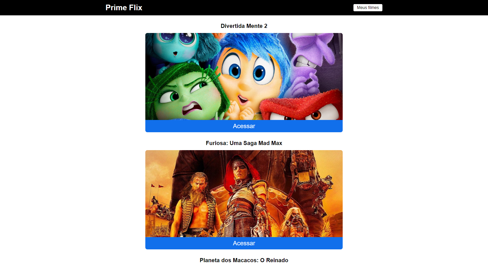
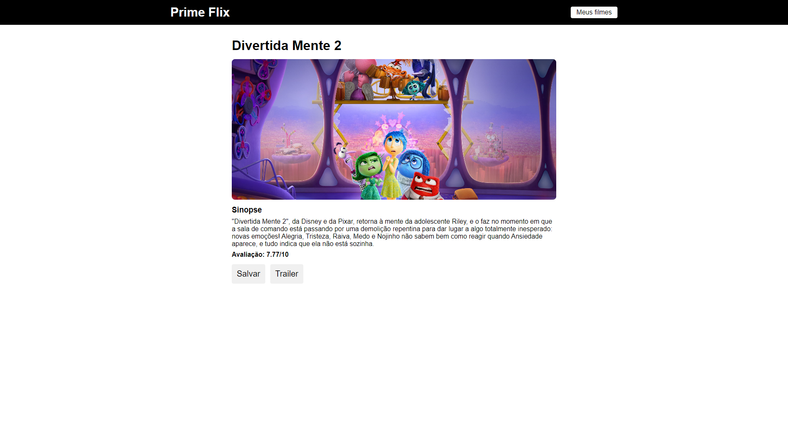
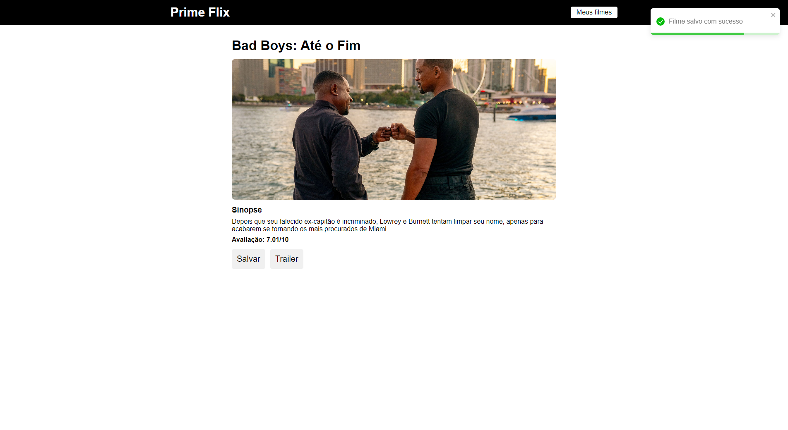
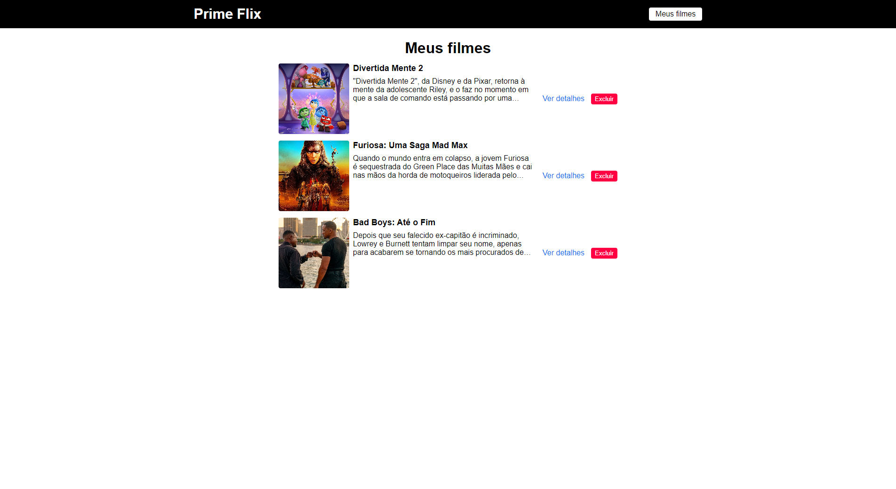
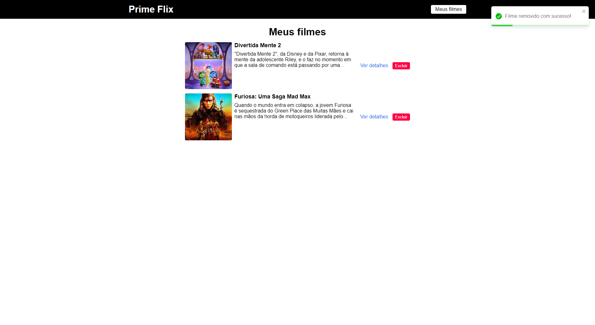

<h1 align="center">🎥 PrimeFlix</h1>

<p align="center">Site de filmes onde usuários podem explorar lançamentos recentes, ver detalhes e favoritar seus preferidos</p>

## 💻 Sobre o projeto

Primeflix é um site interativo dedicado a fãs de cinema que desejam acompanhar os lançamentos mais recentes. Os usuários podem explorar os últimos filmes lançados, visualizar detalhes como sinopse e avaliações, além de marcar seus filmes favoritos para fácil acesso posterior.
Este projeto foi desenvolvido junto ao curso de ReactJS do [Sujeito Programador](https://www.instagram.com/sujeitoprogramador/).

## 🎨 Layout







## 🖥️ Instalação

```bash
$ git clone git@github.com:devjuanvinicius/primeflix.git

$ cd primeflix

$ npm install

$ npm run dev

# A aplicação será aberta na porta:3000 - acesse http://localhost:3000
```

## ⚙️ Variáveis de Ambiente

Para rodar esse projeto, você vai precisar adicionar as seguintes variáveis de ambiente no seu .env

`VITE_API_KEY`

## 🛠️ Tecnologias

- [React](https://react.dev/)
- [React Router Dom](https://github.com/ReactTraining/react-router/tree/master/packages/react-router-dom)
- [React Toastify](https://github.com/fkhadra/react-toastify)
- [Axios](https://github.com/axios/axios)
- [Sass](https://sass-lang.com/)
- [Vite](https://sass-lang.com/)
- [The Movie Database - API](https://www.themoviedb.org/)
